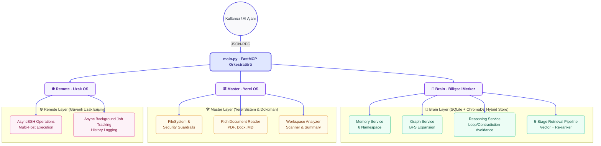

# Versatile-Mcp Unified Suite 🚀

Versatile-Mcp, modern AI ajanları için tasarlanmış tek girişli, yüksek performanslı ve modüler bir **"Agentic OS" (Ajan İşletim Sistemi)** katmanıdır. Bu suite; ajanların bilişsel zekasını, semantik hafızasını ve local/remote erişim gücünü maksimize ederken karmaşıklığı minimize eden bütünleşik bir MCP (Model Context Protocol) ekosistemidir.

> **Bilişsel İlke (0.95^10):** *"Her ek karar adımında hata olasılığı katlanarak artar. %95 başarı oranı, 10 adımda %60'a düşer. Bu yüzden güvenilirlik ve tutarlılık otonomiden önce gelir. Bilişsel gürültüyü azalt, kararları yapılandır."*

---

## 🏛️ Bilişsel Mimari ve Katmanlar

Sistem, 3 ana uzmanlık katmanından (Brain, Master, Remote) oluşur ve tek bir FastMCP orkestratörü (`main.py`) üzerinden ayağa kalkar. `Brain` katmanı, relative importlar aracılığıyla local OS yetenekleriyle çakışma (namespace collision) yaşanmadan tamamen izole edilmiş gelişmiş bir bilişsel mimariye sahiptir.


---

## 🧠 1. Brain Katmanı: Gelişmiş Bilişsel ve Hafıza Mimarisi

Brain katmanı, basit metin saklama yapılarından sıyrılarak **ChromaDB + SQLite Hibrit Depolama (HybridStore)** mimarisine geçiş yapmıştır.

### 6 Namespace Hafıza Düzeni
Tüm bellekler ve ilişkiler, scope kısıtlaması (project_root) ve bağlamsal doğruluk için 6 uzmanlık alanına bölünmüştür:
1. **`code`**: Proje yapısı, fonksiyonlar, API kontratları ve codebase indeksleri.
2. **`user`**: Kullanıcı davranışları, tercihleri ve projeye özgü doğrudan geri bildirimler.
3. **`project`**: Mimari kararlar (ADRs), sistem tasarımları, teknik gereksinimler.
4. **`runtime`**: Aktif görev veya session sırasında kullanılan geçici bağlamlar.
5. **`incident`**: Hata geçmişleri, postmortem analizleri ve çözülen kritik buglar.
6. **`reasoning`**: Düşünce zincirleri, hipotezler ve problem çözme adımları.

### 5-Aşamalı Retrieval Pipeline (Semantik Getirme)
Bilgi getirme, sıradan bir arama motoru gibi değil, 5 katmanlı bir bilişsel boru hattından geçerek temizlenir:
1. **Vector Search:** ChromaDB üzerinden cosine similarity ile en yakın aday adayları çekilir.
2. **Graph Expansion:** BFS (Breadth-First Search) ile ilişkili komşu düğümler grafik üzerinden eklenir (BFS komşu genişletme).
3. **Metadata Filtering:** Güven düzeyi (`confidence`) ve güncellik derecesine (`recency`) göre filtreleme uygulanır.
4. **Re-ranking (ZORUNLU):** Cross-encoder joint scoring ile sorgu ve metin birlikte değerlendirilerek final skorlar hesaplanır.
5. **Context Packing:** Token bütçesi (`max_tokens`) ve kaynak kısıtlamalarına göre tekilleştirme yapılarak en yoğun bağlam paketi oluşturulur.

### Kendini Denetleyen Sequential Thinking & Distillation
- **Döngü ve Çelişki Algılama (Loop Prevention):** `sequentialthinking_add_thought` aracı, ajanın aynı düşünceleri tekrarlamasını (`loop_detected`) veya daha önce kalıcı hale getirilmiş sistemsel gerçeklerle çelişmesini engeller.
- **Damıtma (Distillation):** Bir reasoning oturumu başarıyla tamamlandığında, ajanın ulaştığı kararlar `reasoning_distill` aracıyla kalıcı **Ground Truth Memory** (Sistemsel Gerçekler) katmanına terfi ettirilir ve izlenebilirlik (traceability) grafikleri kurulur.

---

## 🛠️ Detaylı Araç Referansı (30+ Unified Tools)

### 🧠 Bilişsel ve Hafıza Araçları (Brain Layer)
| Modül (Namespace) | Araç Adı | Görev | Önemli Parametreler |
| :--- | :--- | :--- | :--- |
| **Memory** | `memory_write` | Yeni semantik hafıza yazar (duplicate kontrollü) | `content`, `project_root`, `namespace`, `category` |
| | `memory_update` | Bir hafızayı üst versiyona taşır (`supersedes` ilişkisi) | `target_id`, `new_content`, `project_root` |
| | `memory_get` | Tekil bellek ve onun versiyon geçmişini getirir | `node_id`, `include_history` |
| | `memory_query` | Semantik hafızada gelişmiş arama yapar | `query`, `project_root`, `namespace` |
| | `memory_index` | Belirli bir dokümanı parçalayıp hafızaya ekler | `file_path`, `project_root`, `namespace` |
| **Reasoning** | `sequentialthinking_add_thought` | Döngü kontrollü, grafik destekli akıl yürütme adımı | `thought`, `thought_number`, `total_thoughts` |
| | `reasoning_trace_write` | Manuel akıl yürütme izi yazar | `thought`, `project_root`, `data_class` |
| | `reasoning_trace_query` | Geçmiş akıl yürütme izlerinde semantik arama | `query`, `project_root` |
| | `reasoning_distill` | Düşünce oturumunu kalıcı belleğe terfi ettirir | `session_id`, `project_root`, `confidence` |
| **Graph** | `graph_expand` | BFS ile ilişkisel grafik genişletmesi yapar | `start_id`, `depth`, `project_root` |
| | `graph_get_neighbors` | Bir düğümün doğrudan komşularını getirir | `node_id` |
| | `graph_link` | İki hafıza veya düşünce arasına grafik kenarı (edge) ekler | `source_id`, `target_id`, `relation_type` |
| **Workspace** | `workspace_summary` | Çalışma alanının anlık mimari özetini üretir | `project_root`, `max_depth` |

*Not: User, Project ve Codebase modülleri (`user_memory_get`, `project_memory_set` vb.) ilgili namespace sınırları altında doğrudan atomik bellek erişimi sağlar.*

### 🛠️ Yerel Sistem ve Doküman Araçları (Master Layer)
| Araç Adı | Görev | Önemli Parametreler |
| :--- | :--- | :--- |
| `read_rich_document` | PDF, Word, Markdown, Kod dosyalarını bağlamı koruyarak okur | `file_path`, `start_line`, `end_line` |
| `directory_tree` | `.gitignore` kurallarına duyarlı dosya ağacı üretir | `directory`, `max_depth` |
| `grep_search` | Ripgrep ile yüksek hızlı desen ve içerik araması yapar | `query`, `includes`, `search_path` |
| `validate_syntax` | Python, JS vb. kodların derleme ve sözdizimi doğruluğunu denetler | `file_path` |

### 🌐 Güvenli Uzak Erişim ve Asenkron İşler (Remote Layer)
| Araç Adı | Görev | Önemli Parametreler |
| :--- | :--- | :--- |
| `ssh_execute` | Uzak sunucuda güvenli komut çalıştırır (arka plan desteğiyle) | `host`, `command`, `run_in_background` |
| `check_job_status` | Uzun süren SSH arka plan işlerinin durumunu sorgular | `job_id` |
| `get_ssh_history` | Geçmiş SSH oturumlarının ve komutlarının listesini getirir | `host` |

---

## 🛡️ Güvenlik Korumaları ve Kurallar (Guardrails)

Ajanlarımızın otonom hareket ederken sisteme zarar vermesini engellemek için tasarlanmış sıkı güvenlik kuralları:
- **İnsan Onayı (Human-in-the-loop):** Kritik, yıkıcı ve geri döndürülemez tüm işlemler (`delete_*`, `ssh_execute`) için **kullanıcı onayı zorunludur** ve sistem tarafından onay müzakere edilemez.
- **Sessiz Bozulma Yerine Dur:** Sistemde bir hata algılandığında (örn. çelişkili durum veya Foreign Key hatası) sessizce devam etmek yerine, durur, raporlar ve güvenli geri alma (rollback) işlemini başlatır.
- **Güven Eşiği Sınırı (Distillation Threshold):** `reasoning_distill` aracıyla Ground Truth Memory'ye bilgi terfi ettirmek için `confidence` (güven oranı) **en az 0.85** olmalıdır. Ajanın kendinden emin olmadığı kararlar sistemsel gerçek olamaz.
- **Dosya Erişim Güvenliği:** Yerel dosya işlemleri master katmanındaki `ALLOWED_ROOTS` ve `IgnoreService` tarafından sıkıca sınırlandırılmıştır; yetkisiz dizin okuma ve yazmaları tamamen engellenir.

---

## 🚀 Kurulum ve Yapılandırma

### 1. Gereksinimlerin Yüklenmesi
```bash
pip install -r requirements.txt
```

### 2. Ortam Değişkenleri (.env)
Aşağıdaki değişkenleri projenin kök dizinindeki `.env` dosyasında tanımlayın:

```env
# Global
MCP_DATA_DIR=.data
MCP_DB_TIMEOUT=30

# Brain (Hibrit RAG & Embedding)
EMBEDDING_MODEL_PATH=resources/models/embedding_model.gguf
RAG_CHUNK_SIZE=512
RAG_CHUNK_OVERLAP=64
RAG_TOP_K=5
RAG_N_GPU_LAYERS=0
RAG_N_THREADS=4
RAG_N_CTX=2048

# Master & Remote
REMOTE_LOG_DIR=./logs/remote
```

### 3. Claude Desktop / IDE Yapılandırması
Versatile-Mcp'yi bir MCP istemcisine (örn: Claude Desktop) kaydetmek için `mcp_config.json` dosyanıza aşağıdaki yapılandırmayı ekleyin.

**Dikkat:** args ve env altındaki yolları kendi sisteminize göre absolute (mutlak) olarak güncelleyin.

```json
{
  "mcpServers": {
    "versatile-mcp": {
      "command": "python",
      "args": [
        "/absolute/path/to/Versatile-Mcp/main.py"
      ],
      "env": {
        "MCP_DATA_DIR": "/absolute/path/to/Versatile-Mcp/.data",
        "EMBEDDING_MODEL_PATH": "/absolute/path/to/Versatile-Mcp/resources/models/embedding_model.gguf"
      },
      "disabled": false
    }
  }
}
```

---

## 🔄 Ajan Çalışma Desenleri (Agent Patterns)

Sunucudan maksimum bilişsel verim elde etmek için ajanların şu desenleri uygulaması beklenir:

### 1. ReAct Döngüsü
Ajan, karmaşık bir problemi çözerken önce `sequentialthinking_add_thought` aracıyla plan yapar (`Thought`), ardından yerel veya uzak OS araçlarıyla eyleme geçer (`Action`) ve son olarak eylemin sonucunu gözlemleyerek (`Observation`) yeni adımlar planlar.

### 2. Akıl Yürütme ve Damıtma Akışı
Ajan, karmaşık codebase veya sistem mimarisi üzerinde çalışırken:
1. `sequentialthinking_add_thought` ile adımları ilerletir.
2. Karar anında `reasoning_trace_write` ile karar hipotezini yazar.
3. Sonuç doğrulandıktan sonra `reasoning_distill` ile ulaştığı ADR (Architectural Decision Record) veya codebase bilgisini `confidence=0.95` ile kalıcı Ground Truth belleğine aktarır.

---

## 👨‍💻 Geliştirici Rehberi

Yeni bir araç veya sunucu katmanı eklemek için:
1. **Dahili Dosya İçi Importlar:** `servers/brain` altındaki herhangi bir dosyada diğer brain bileşenlerini import ederken, **relative import** (`from .memory_service import MemoryService`, `from ..storage.hybrid_store import HybridStore`) kullanın. Bu, yerel OS modülleriyle çakışmayı önler.
2. **FastMCP Araç Tanımı:** `servers/brain/tools/` altındaki ilgili modüle `@mcp.tool()` dekoratörüyle fonksiyonunuzu ekleyin. Fonksiyon parametrelerinin ve geri dönüş tiplerinin tip tanımlamalarını (Type Hints) ve detaylı docstring açıklamalarını eksiksiz yapın.
3. ** main.py Kaydı:** Yeni araç setinizin register fonksiyonunu `main.py` başlangıcında çağırarak orkestrasyona dahil edin.

---
*Geliştirilen Her Karar, Güvenilir Bir Gelecek İçin.*
