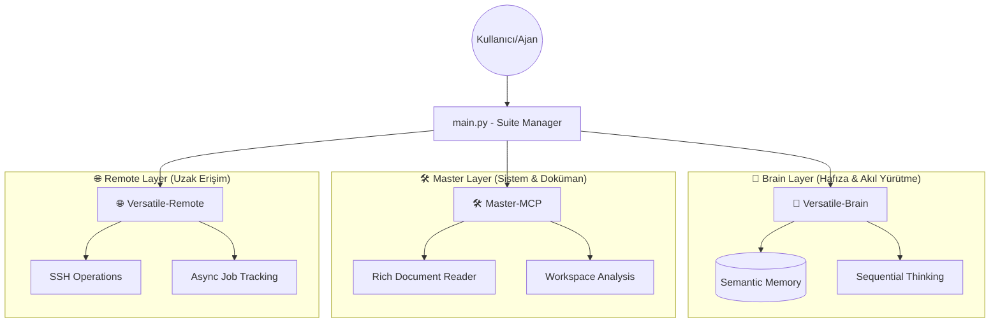

# Versatile-Mcp Unified Suite 🚀

Versatile-Mcp, modern AI ajanları için tasarlanmış tek girişli, yüksek performanslı ve modüler bir MCP (Model Context Protocol) sunucu ekosistemidir. Bu suite, ajanların zekasını, hafızasını ve erişim gücünü maksimize ederken karmaşıklığı minimize eden bir "Agentic OS" katmanı görevi görür.

> **Temel İçgörü:** "Her ek karar, hata olasılığını çarpar. %95 başarı → 10 adımda %60'a düşer. Güvenilirlik önce, otonomi sonra."

---

## 🏛️ Mimari Mimari ve Katmanlar

Sistem, üç ana uzmanlık katmanından oluşur ve merkezi bir `main.py` üzerinden yönetilir:



### 1. 🧠 Versatile-Brain (Intelligence & Memory)
Bilinçli hafıza ve mantık yürütme katmanıdır. Ajanın geçmiş kararları hatırlamasını ve karmaşıklığı yönetmesini sağlar.
- **Hafıza:** Semantik arama ile projeye özgü bilgileri (fact/category) depolar.
- **Akıl Yürütme:** `sequentialthinking` ile lineer olmayan problemleri adım adım çözer.

### 2. 🛠️ Master-MCP (Workspace & Content)
Yerel sistem ve dokümanlarla etkileşim kuran katmandır.
- **Zengin Okuma:** PDF, Docx, EPUB ve büyük kod dosyalarını bağlamı koruyarak okur.
- **Denetim:** `validate_syntax` ve `grep_search` ile kod kalitesini ve tutarlılığını sağlar.

### 3. 🌐 Versatile-Remote (Secure Execution)
Uzak sunucularda güvenli işlem yapma yeteneğidir.
- **Asenkron Yapı:** Uzun süren işleri arka planda çalıştırır ve durum takibi yapar.

---

## 🛡️ Temel Prensipler ve Güvenlik (Guardrails)

Ajanlarımızın başarısını şansa bırakmıyoruz. Tüm işlemler şu 6 temel prensip üzerine inşa edilmiştir:

1.  **Güvenilirlik Önce:** Her adımda hata payını hesapla ve doğrula (0.95^10 kuralı).
2.  **Kapsam Kısıtla:** Spesifik alanlarda uzmanlaşmış (domain-specific) yetenekleri kullan.
3.  **İnsan Onayı (Human-in-the-loop):** Kritik ve geri döndürülemez aksiyonlar (`delete_*`, `ssh_execute`) için **her zaman** kullanıcı onayı müzakere edilemezdir.
4.  **Sessiz Bozulma Yerine Dur:** Bir hata tespit edildiğinde sessizce devam etmek yerine, güvenli bir şekilde dur ve geri al (rollback).
5.  **Her Şeyi Logla:** Debuglanamayan ajan prodüksiyonda ölüdür. Tüm düşünce izlerini kaydet.
6.  **En Az Yetki (Least Privilege):** Her görev için sadece gerekli olan yetki setini tanımla.

---

## 🛠️ Detaylı Araç Referansı (API)

### 🧠 Zeka ve Hafıza
| Araç | Görev | Önemli Parametreler |
| :--- | :--- | :--- |
| `commit_knowledge` | Bilgi kaydeder | `fact`, `category`, `project_root` |
| `search_knowledge` | Hafızada arama | `query`, `n` (sonuç sayısı) |
| `sequentialthinking` | Mantık yürütme | `thought`, `thought_number`, `total_thoughts` |
| `workspace_summary` | Mimari özet | `directory` |

### 🛠️ Workspace ve Dokümanlar
| Araç | Görev | Önemli Parametreler |
| :--- | :--- | :--- |
| `read_rich_document` | PDF/Kod okuma | `file_path`, `start_line`, `end_line` |
| `directory_tree` | Dosya ağacı | `directory`, `max_depth` |
| `grep_search` | Ripgrep arama | `query`, `includes` (dosya filtreleri) |
| `validate_syntax` | Kod denetimi | `file_path` |

### 🌐 Uzak İşlemler
| Araç | Görev | Önemli Parametreler |
| :--- | :--- | :--- |
| `ssh_execute` | Komut çalıştırır | `host`, `command`, `run_in_background` |
| `check_job_status` | İş takibi | `job_id` |
| `get_ssh_history` | SSH geçmişi | `host` |

---

## 🔄 Ajan Çalışma Desenleri (Agent Patterns)

Versatile-Mcp, aşağıdaki stratejik desenlerle birlikte kullanıldığında maksimum verim sağlar:

### 1. ReAct (Reasoning + Acting)
`Thought → Action → Observation` döngüsü. Her adımdan sonra agent'ın neyi başardığını ve sonraki adımının ne olduğunu `sequentialthinking` ile belirtmesi zorunludur.

### 2. Role-Based Self-Audit (Çoklu Perspektif)
Hataları minimize etmek için tek bir ajana farklı roller vererek çapraz denetim sağlayın:
- **Developer:** Mantık ve edge case'leri inceler.
- **Security:** Güvenlik açıklarını tarar.
- **Synthesizer:** Tüm bulguları birleştirir ve nihai aksiyonu sunar.

---

## 🚀 Kurulum ve Yapılandırma

### 1. Kurulum
```bash
pip install -r requirements.txt
```

### 2. Ortam Değişkenleri (.env)
| Değişken | Açıklama | Varsayılan |
| :--- | :--- | :--- |
| `BRAIN_DATA_DIR` | Hafıza verilerinin saklanacağı dizin | `~/.versatile-mcp` |
| `EMBEDDING_MODEL_PATH`| Vektör modeli yolu (.gguf) | Zorunlu |
| `REMOTE_LOG_DIR` | Uzak iş loglarının tutulacağı dizin | `./logs/remote` |

### 3. Çalıştırma
```bash
python main.py
```

### 4. Claude Desktop / IDE Yapılandırması
Versatile-Mcp'yi bir MCP istemcisine (örn: Claude Desktop) kaydetmek için `mcp_config.json` dosyanıza aşağıdaki yapılandırmayı ekleyin.

**Dikkat:** `args` kısmındaki dosya yolunu kendi sisteminize göre güncelleyin.

```json
{
  "mcpServers": {
    "versatile-mcp": {
      "command": "python",
      "args": [
        "C:/KULLANICI_YOLU/Versatile-Mcp/main.py"
      ],
      "env": {
        "BRAIN_DATA_DIR": "C:/Users/KULLANICI/.versatile-mcp", // (Opsiyonel - Varsayılan: ~/.versatile-mcp)
        "EMBEDDING_MODEL_PATH": "C:/MODELS/model.gguf" // (Zorunlu)
      },
      "disabled": false
    }
  }
}
```

> **İpucu:** Ortam değişkenlerini doğrudan JSON içindeki `env` bloğuna yazabilir veya sistem genelinde tanımlayabilirsiniz. (Not: Yukarıdaki JSON'da yer alan `//` yorum satırları sadece açıklama amaçlıdır, bazı sistemlerde hata almamak için bunları silebilirsiniz.)

---

## 👨‍💻 Geliştirici Rehberi

Yeni bir araç veya sunucu eklemek için:
1. `servers/` altında ilgili katmanda (brain/master/remote) fonksiyonunuzu tanımlayın.
2. `main.py` dosyasındaki `Mcps` sınıfına yeni aracınızı kaydedin.
3. Parametrelerin tip tanımlamalarını (Type Hints) eksiksiz yapın.

---
*Geliştirilen Her Karar, Güvenilir Bir Gelecek İçin.*
