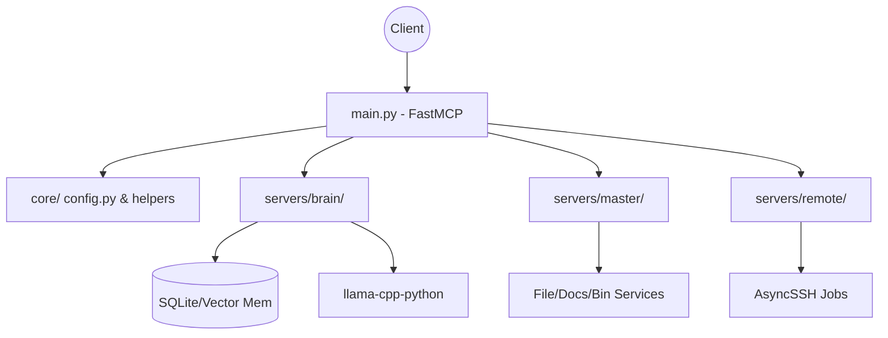

# init.md

> Auto-generated by /init skill. Update manually for project-specific context.

## Project Overview

| Field | Value |
|-------|-------|
| Type | App / Service / Tool |
| Language | Python 3 |
| Framework | FastMCP / MCP |
| Platform | Cross-platform |

Versatile-Mcp, AI ajanları için hafıza, akıl yürütme (reasoning), yerel dosya ve uzak sunucu yönetimini birleştiren modüler bir "Agentic OS" MCP sunucu ekosistemidir.

---

## Build & Run

```bash
# install dependencies
pip install -r requirements.txt

# run
python main.py
```

---

## Architecture

Sistem 3 ana katmandan oluşur (Brain, Master, Remote) ve hepsi merkezi `main.py` üzerinden `FastMCP` kullanılarak ayağa kalkar. "Brain" katmanı semantik hafıza ve AI model motorunu (llama-cpp-python) içerir. "Master" katmanı yerel dosya sistemi ve doküman işleme (pymupdf, vs.) yeteneklerini taşır. "Remote" katmanı ise SSH ve asenkron iş takibinden sorumludur. Tüm yetenekler ayrık `register_*_tools` fonksiyonları ile `main.py` de toplanır.

### Directory Structure

```
Versatile-Mcp/
├── core/      — Sistem yapılandırması (Config) ve çekirdek yardımcılar (Llama engine, ignore_svc)
├── servers/
│   ├── brain/   — Semantik hafıza, akıl yürütme (sequentialthinking), analiz araçları
│   ├── master/  — Dosya okuma/yazma, zengin doküman okuma, grep, syntax kontrol
│   └── remote/  — SSH üzerinden uzak komut çalıştırma ve async job takibi
```

### Layer Map

| Layer | Dir | Responsibility |
|-------|-----|----------------|
| Orchestration | `core/` | Yapılandırma, Llama sağlayıcısı, Ignore servisleri |
| Intelligence | `servers/brain/` | Vektör veritabanı (SQLite), Akıl yürütme döngüsü |
| Local OS | `servers/master/` | Dosya sistemi, path çözme (BinService), Teşhis (Diagnostic) |
| Remote OS | `servers/remote/` | SSH işlemleri, arka plan işleri |

---

## Entry Points

| Role | File |
|------|------|
| Main / startup | `main.py` |
| Config / Settings | `core/config.py`, `.env` |
| Master Services | `resources/config/settings.py` |

---

## Key Files

| File | Role |
|------|------|
| `main.py` | Tüm araçların ve servislerin MCP'ye (FastMCP) kaydedildiği ana giriş noktasıdır. |
| `core/helpers/llama_engine/provider.py` | GGUF modelini kullanarak gömme (embedding) ve AI metin üretimini yönetir. |
| `servers/master/services/filesystem.py` | Dosya işlemlerini güvenlik sınırlarına (ALLOWED_ROOTS) göre gerçekleştirir. |

---

## Data Models

| Model | Where defined | Purpose |
|-------|--------------|---------|
| `Config` | `core/config.py` | Environment değişkenlerini (`BRAIN_DATA_DIR`, `EMBEDDING_MODEL_PATH`) doğrular ve yükler. |

---

## Core Services / Components

| Name | File | Responsibility |
|------|------|----------------|
| `MemoryService` | `servers/brain/services/memory/service.py` | SQLite ve vektör arama (embedding) kullanarak ajanlar için semantik hafıza sağlar. |
| `ThinkingLoop` | `servers/brain/services/reasoning/thinking.py` | Lineer olmayan ajan mantığını (sequential thinking) yönetir. |
| `BinService` | `servers/master/services/system/bin_service.py` | Kullanılacak araçların platform bazlı binary yollarını bulur. |

---

## Database / Persistence

| Field | Value |
|-------|-------|
| Engine | SQLite + Vector Storage (Numpy) |
| Location | `~/.versatile-mcp` (varsayılan) veya `BRAIN_DATA_DIR` env. değişkeni |
| ORM / client | N/A (Yerleşik veya özel SQL sarmalayıcısı) |
| Migration strategy | Manual |
| Key tables | Knowledge Base / Facts (Hafıza objeleri) |

---

## External Dependencies

| Package | Why it's here |
|---------|---------------|
| `fastmcp` | MCP sunucusunu hızlı ayağa kaldırmak ve araçları deklare etmek için. |
| `llama-cpp-python` | GGUF dosyaları (yerel LLM) üzerinden embedding ve inference yapmak için. |
| `pymupdf`, `python-docx`, `ebooklib` | Zengin doküman türlerini (PDF, Word, EPUB) okuyabilmek için. |
| `asyncssh` | Uzak sunuculara SSH bağlantısı kurmak ve komut yürütmek için. |

---

## Documentation

| Document | Location | Purpose |
|----------|----------|---------|
| `README.md` | `README.md` | Mimariyi, kurulum adımlarını ve MCP istemcisi (Claude) ayarlarını açıklar. |

---

## Security & Technical Debt

- **Security:** `delete_*` ve `ssh_execute` gibi tehlikeli işlemler her zaman insan onayı (human-in-the-loop) gerektirir. Master servislerinde dosya sistemine erişim `ALLOWED_ROOTS` ve `IgnoreService` ile kısıtlanmıştır. Stdout güvenliği için `main.py` de fd 1 kapatılmıştır.
- **Technical Debt:** Llama engine CPU thread yönetimi ve local embedding model performans optimizasyonu. Asenkron (remote jobs) loglama sisteminin sağlamlaştırılması.

---

## Non-Obvious Conventions

- Hata durumunda sessizce devam etmek (fail silently) yerine durulur, raporlanır ve gerekirse işlem geri alınır (rollback).
- Sistemde bir işlem yapıldıktan sonra ajanın `sequentialthinking` aracını kullanarak durum değerlendirmesi yapması beklenir (ReAct paterni).

---

## Known Constraints / Gotchas

- **GGUF Model Gereksinimi:** `EMBEDDING_MODEL_PATH` tanımlanmadan `Brain` (memory/thinking) servisleri ayağa kalkmaz.
- **Standart Çıktı Yönlendirmesi:** MCP protokolü standart çıktıyı (stdout) JSON-RPC için kullandığından `main.py` içinde loglar ve normal stdout, `sys.stderr`'e yönlendirilmiştir. Print komutları stdout bozmaması için loglama kullanılmalıdır.

---

## Not Yet Implemented / In-Progress

- **[ ] Pending — Feature:** Kapsamlı otomatik test suite ve unit test entegrasyonu.
- **[ ] Pending — Data / Performance:** Geniş dokümanların okunmasında ve embedding işlemlerinde hız optimizasyonları.
- **[ ] Pending — Critical Security:** Uzak sunucu (SSH) bağlantılarında Key Management / Vault entegrasyonu.
- **[ ] Pending — Refactor:** `main.py`'nin çok daha modüler başlatıcılara (bootstrappers) bölünmesi.

---

## 🧠 Agent Intelligence (Auto-Generated Deep Analysis)

> **FOR AI AGENTS:** This section contains high-density technical context. Parse this JSON and Mermaid graph before suggesting architecture or logic changes.

### Core Architecture Graph



### Deep Context & Constraints

```json
{
  "agent_directives": {
    "imperative_rules": [
      {
        "directive": "DO NOT execute ssh or file delete operations without explicit user confirmation.",
        "rationale": "Human-in-the-loop is mandatory for destructive or remote operations per project principles.",
        "example_snippet": "# Wait for user approval before ssh_execute"
      },
      {
        "directive": "DO NOT print to sys.stdout directly.",
        "rationale": "FastMCP uses stdout for JSON-RPC communication. All logs and custom prints must go to sys.stderr.",
        "example_snippet": "import sys; print('log message', file=sys.stderr)"
      },
      {
        "directive": "DO use sequentialthinking after complex actions.",
        "rationale": "The system follows ReAct patterns, requiring thought formulation before and after critical actions.",
        "example_snippet": "call_mcp_tool('sequentialthinking', thought='I successfully updated the file, now I must test it')"
      }
    ],
    "variable_mappings": {
      "Data Directory": "Config.DATA_DIR",
      "Model Path": "Config.MODEL_PATH",
      "Llama Engine Provider": "core.helpers.llama_engine.provider.LlamaProvider"
    },
    "architectural_patterns": [
      "Modular Services injected to FastMCP",
      "Event-driven Async operations in Remote Layer",
      "Semantic Search via Local Llama Embeddings"
    ],
    "testing_strategy": {
      "framework": "pytest (implied/pending)",
      "verification_command": "python main.py (dry run startup test)"
    }
  },
  "project_context": {
    "primary_data_flow": "Client -> FastMCP -> Tools (Brain/Master/Remote) -> Service Layer -> FileSystem / SQLite / SSH",
    "critical_dependencies": {
      "internal": ["core.config", "core.helpers.llama_engine", "servers.master.services"],
      "external": ["fastmcp", "llama-cpp-python", "pymupdf", "asyncssh"]
    }
  },
  "risk_zones": [
    {
      "module": "main.py",
      "failure_mode": "stdout pollution causing FastMCP JSON-RPC parsing failures.",
      "mitigation_strategy": "Sys.stdout is reassigned to sys.stderr at the top of main.py. Ensure no external libraries forcefully write to fd 1."
    },
    {
      "module": "servers/brain/services/memory/service.py",
      "failure_mode": "OOM (Out of memory) during embedding generation for large documents.",
      "mitigation_strategy": "Chunk inputs efficiently and ensure llama-cpp-python thread/GPU limits are strictly enforced."
    }
  ],
  "db_strategy": {
    "how_to_read": "Use MemoryService to semantically search or retrieve facts.",
    "how_to_update": "call commit_knowledge tool to write to SQLite/Vector memory.",
    "sharding_logic": "N/A"
  },
  "implicit_state": {
    "global_variables": ["sys.stdout redirection in main.py", "FastMCP mcp instance in main.py"],
    "environment_requirements": ["EMBEDDING_MODEL_PATH must be valid GGUF file path in .env", "BRAIN_DATA_DIR folder must be writable"]
  }
}
```
